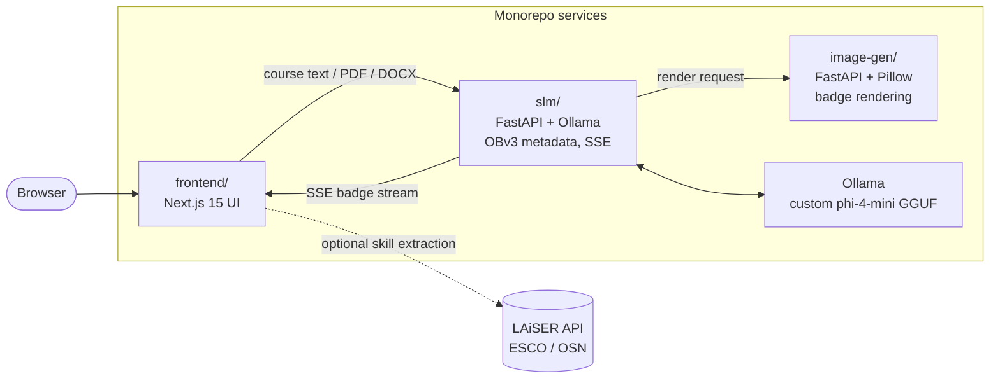

# DCC Credential Co-writer

[](LICENSE)
[](frontend/)
[](slm/)
[](slm/models/)

An open, AI-assisted **Open Badges v3** authoring system. Paste or upload
course content and co-write standards-compliant digital credentials: title,
description, criteria, skills, and a rendered badge image, in 23 languages,
with a streaming, human-in-the-loop editor.

<p align="center">
  
</p>

## Architecture



Formerly three standalone repositories, merged here with full git history:

| Directory    | Former repo                                                                                | What it is                                          |
|--------------|--------------------------------------------------------------------------------------------|-----------------------------------------------------|
| [`frontend/`](frontend/)   | [mit-badge-front-end](https://github.com/digitalcredentials/mit-badge-front-end)           | Next.js 15 UI (static export served by nginx)       |
| [`slm/`](slm/)             | [mit-slm](https://github.com/digitalcredentials/mit-slm)                                   | FastAPI + Ollama: badge metadata, SSE streaming     |
| [`image-gen/`](image-gen/) | [mit-badge-image-generation](https://github.com/digitalcredentials/mit-badge-image-generation) | FastAPI + Pillow: layered badge image composition |

## Quick start

**Prerequisites:**

- Docker and Docker Compose
- The **custom-trained phi-4-mini instruct model** (GGUF, about 2.4 GB, not
  committed). This is a fine-tuned small language model trained specifically
  for Open Badges v3 metadata generation, and it runs **CPU based**: no GPU
  is required. Point `MODEL_GGUF_PATH` in `.env` at your copy. The `ollama`
  service bind-mounts it read-only and imports it into its local blob store
  on first start via [`slm/models/Modelfile`](slm/models/Modelfile).

```bash
cp env.example .env        # adjust origins / ports / model path
docker compose up --build -d
```

| Service   | URL                          |
|-----------|------------------------------|
| Frontend  | http://localhost:3000        |
| SLM API   | http://localhost:8000/docs   |
| Image API | http://localhost:3001/docs   |

Generate a badge from the command line:

```bash
curl -X POST http://localhost:8000/api/v1/generate-badge-suggestions \
  -H 'Content-Type: application/json' \
  -d '{
    "course_input": "Introduction to Python Programming: variables, control flow, functions, file I/O.",
    "badge_configuration": {"badge_style": "Academic", "language": "en"},
    "image_generation": {"enable_image_generation": true,
                         "image_configuration": {"shape": "hexagon"}}
  }'
```

## Performance (CPU)

Measured on a 20-core Arm CPU with the stack as-is (no GPU, single request):

| Metric | Value |
|--------|-------|
| Prompt evaluation | ~190 tokens/s |
| Generation | ~33 tokens/s |
| Full badge with rendered PNG | 16.4s average (12s to 21s over 5 runs) |
| Model import on first start | < 1 min |

Throughput scales with CPU core count and clock; a loaded host slows
generation dramatically. GPU offload also works with the same compose file
by granting the `ollama` service GPU access, but is not required.

## Configuration

All cross-service URLs and CORS origins are env-driven, see
[`env.example`](env.example). The only value baked at build time is
`NEXT_PUBLIC_API_BASE_URL` (the frontend is a static export; rebuild the
frontend image to change it).

| Variable | Purpose |
|----------|---------|
| `CORS_ORIGINS_STR` | Comma-separated origin allowlist for both APIs |
| `NEXT_PUBLIC_API_BASE_URL` | SLM API base URL as reached from the browser |
| `BADGE_ISSUER_URL` | Public base URL used in OBv3 achievement image IRIs |
| `MODEL_GGUF_PATH` | Host path to the custom phi-4-mini GGUF weights |
| `NEXT_PUBLIC_LAISER_*` | Optional LAiSER skill-extraction API (see note) |

> **CORS note:** both APIs use an explicit origin allowlist. A wildcard
> origin is invalid with credentialed requests. Set the real frontend
> origin(s) for any non-local deployment.

> **LAiSER note:** `NEXT_PUBLIC_*` values are inlined into the client bundle.
> Any LAiSER credential shipped this way is visible to end users. For a
> public deployment, front the LAiSER API with a server-side proxy that
> holds the key.

## Per-service docs

Each directory keeps its original README with a full API reference:
[frontend/README.md](frontend/README.md) ·
[slm/README.md](slm/README.md) ·
[image-gen/README.md](image-gen/README.md)

Release audit (security/quality findings and their status):
[AUDIT.md](AUDIT.md)

## Acknowledgments

The Credential Co-writer was developed through a collaboration led by the
**Digital Credentials Consortium (DCC)** and funded by **Walmart**, with
contributions from **Western Governors University**, **George Washington
University (LAiSER)**, **OneOrigin Inc.**, and **Axim Collaborative (Open edX)**.

## License

Released under the [MIT License](LICENSE), copyright 2026 Digital
Credentials Consortium. Bundled fonts are licensed separately under the SIL
Open Font License 1.1 (Arimo, Open Sans, Roboto).
