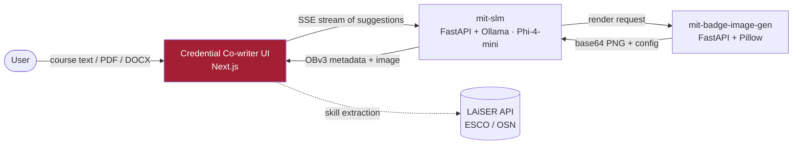

# Credential Co-writer — Web UI

> The authoring interface for the **Credential Co-writer**, an open, AI-assisted Open Badges v3 authoring system from the [Digital Credentials Consortium](https://digitalcredentials.mit.edu/). Paste or upload course content and co-write standards-compliant digital credentials — title, description, criteria, skills, and badge image — with a streaming, human-in-the-loop editor.

<p align="center">
  
</p>

<p align="center">
  <a href="LICENSE"></a>
  
  
  
  
</p>

---

## What this is

A **Next.js 15** (App Router) single-page experience that guides an issuer from raw course material to a finished Open Badges v3 credential:

1. **Input** — type course content or upload a PDF/DOCX (parsed in-browser), choose style, tone, level, language, and institution.
2. **Suggestions** — the credential is streamed back token-by-token over Server-Sent Events from the [mit-slm](https://github.com/oneorigin-inc/mit-slm) backend; optionally enrich it with ESCO/OSN skills via the LAiSER API.
3. **Editor** — review and refine every field, regenerate individual fields, design the badge image, and export the credential.

State is managed with Redux Toolkit (persisted to `localStorage`), and the app builds to a fully static bundle.

## Where it fits



- **mit-badge-front-end** *(this repo)* — the authoring UI.
- **[mit-slm](https://github.com/oneorigin-inc/mit-slm)** — generates the OBv3 metadata.
- **[mit-badge-image-gen](https://github.com/oneorigin-inc/mit-badge-image-generation)** — renders the badge image.

## Routes

| Route | Purpose |
|---|---|
| `/` | Input: course content or PDF/DOCX upload, badge configuration |
| `/suggestions` | Streaming credential suggestions (SSE), skill enrichment |
| `/editor` | Full credential editor, per-field regeneration, badge-image design, export |
| `/about` | Project background and collaborators |
| `/results` | Legacy non-streaming results view (retained) |

## Features

- **Streaming generation** — Server-Sent Events render the credential as the model writes it.
- **Document ingestion** — client-side PDF (`pdfjs-dist`) and DOCX (`mammoth`) parsing; the PDF worker is self-hosted, not loaded from a third-party CDN.
- **Skill enrichment** — optional ESCO/OSN skill extraction via the LAiSER API.
- **Human-in-the-loop editor** — edit any field, regenerate single fields, and design the badge image (shape, colors, logo, icon).
- **Accessible, themeable UI** — Radix UI primitives, semantic markup, and a DCC-branded design system.
- **Static deploy** — exports to a static bundle suitable for S3 + CloudFront or any static host.

## Quick start

### Prerequisites
- Node.js 18+ and npm
- A running [mit-slm](https://github.com/oneorigin-inc/mit-slm) backend (and, for images, [mit-badge-image-gen](https://github.com/oneorigin-inc/mit-badge-image-generation))

### Run

```bash
npm install

# point the app at your backend
echo 'NEXT_PUBLIC_API_BASE_URL=http://localhost:8000/api/v1' > .env.local

npm run dev          # http://localhost:3000
```

### Scripts

```bash
npm run dev          # Dev server (Turbopack)
npm run build        # Static production build -> ./out
npm run start        # Serve the production build
npm run lint         # ESLint
npm run typecheck    # tsc --noEmit
```

## Configuration

The app is configured entirely through `NEXT_PUBLIC_*` environment variables (read at build time):

| Variable | Purpose |
|---|---|
| `NEXT_PUBLIC_API_BASE_URL` | mit-slm backend base URL, e.g. `https://api.your-host/api/v1` |
| `NEXT_PUBLIC_LAISER_API_BASE_URL` | LAiSER API base URL (skill extraction) |
| `NEXT_PUBLIC_LAISER_API_KEY` | LAiSER API key |
| `NEXT_PUBLIC_LAISER_LAISER_ENDPOINT` · `NEXT_PUBLIC_LAISER_RESULT_ENDPOINT` | LAiSER submit / result paths |

> **Production note:** because `NEXT_PUBLIC_*` values are inlined into the client bundle, any LAiSER credential shipped this way is visible to end users. For a public deployment, front the LAiSER API with a server-side proxy (or a serverless function) that holds the key, and rotate any key that has been shipped to the browser.

## Tech stack

- **Next.js 15** (App Router, static export) · **React 18** · **TypeScript**
- **Tailwind CSS** + **Radix UI** for styling and accessible primitives
- **Redux Toolkit** + **redux-persist** for state
- **Server-Sent Events** for streaming · `pdfjs-dist` + `mammoth` for document parsing

## Project structure

```
src/
├── app/                    # Routes: /, /suggestions, /editor, /about, /results
├── components/
│   ├── genai/              # Feature components (suggestion cards, image config, streaming status)
│   └── ui/                 # Radix-based UI primitives
├── hooks/                  # Streaming generator, LAiSER job, toast, responsive
├── lib/                    # SSE API client, types, file parsing
├── store/                  # Redux Toolkit slices (+ redux-persist)
└── utils/                  # LAiSER result mapping
public/                     # Static assets (self-hosted PDF worker, animations)
docs/                       # Documentation + images
```

## Acknowledgments

The Credential Co-writer was developed through a collaboration led by the **Digital Credentials Consortium (DCC)** and funded by **Walmart**, with contributions from **Western Governors University**, **George Washington University (LAiSER)**, **OneOrigin**, and **Axim Collaborative (Open edX)**.

## License

Released under the [MIT License](LICENSE).
