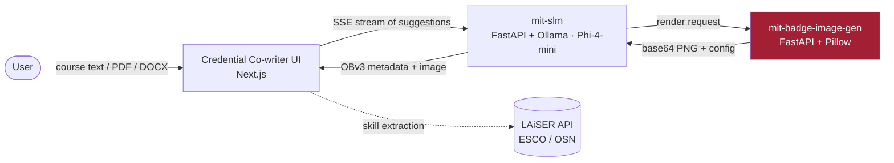

# Badge Image Generation Service

> Layered, deterministic badge-image rendering for the **Credential Co-writer** — an open, AI-assisted Open Badges v3 authoring system from the [Digital Credentials Consortium](https://digitalcredentials.mit.edu/).

<p align="center">
  
</p>

<p align="center">
  <a href="LICENSE"></a>
  
  
  
</p>

---

## What this is

A stateless **FastAPI + Pillow** microservice that renders credential badge images from a declarative, layer-based configuration. It turns simple inputs (a title, an institution, brand colors, a shape) into a finished PNG — composing backgrounds, geometric shapes, gradients, ribbons, logos, icons, and dynamically-wrapped text.

Every image is reproducible: the same configuration always renders the same badge, and each response returns both the rendered PNG **and** the exact configuration used to produce it.

> The badges above are real, unedited output from this service's rendering API.

## Where it fits

The Credential Co-writer is three cooperating services. This repository is the **renderer**.



- **[mit-slm](https://github.com/oneorigin-inc/mit-slm)** — generates Open Badge v3 metadata with a local small language model and calls this service for the image.
- **mit-badge-image-gen** *(this repo)* — renders the visual badge.
- **[mit-badge-front-end](https://github.com/oneorigin-inc/mit-badge-front-end)** — the authoring UI.

## Features

- **Layer-based composition** — `BackgroundLayer`, `ShapeLayer`, `LogoLayer`, `ImageLayer`, `TextLayer`, each with a z-index, combined into one canvas.
- **Three badge shapes** — `hexagon`, `circle`, `rounded_rect`, with solid or gradient fills and optional ribbons.
- **Two authoring modes** — text-overlay badges (title + achievement phrase) and icon badges (icon auto-matched from a curated library via TF-IDF similarity).
- **Shape-aware text** — multi-line wrapping and sizing that respects the shape's bounds.
- **Brand-color aware** — pass an institution's primary/secondary/border colors, or fall back to curated palettes.
- **Reproducible** — deterministic rendering; the full config is returned with every image.
- **Production-minded** — request/response logging with sensitive-header redaction, log rotation, runs as a non-root container user.

## Sample output

| Hexagon · text overlay | Circle · icon | Rounded rectangle · text overlay |
|:---:|:---:|:---:|
|  |  |  |

Each image above was produced by the corresponding API call in [Usage](#usage).

## Quick start

### Prerequisites
- Python 3.9+ (local), or Docker + Docker Compose
- ~1 GB free disk for dependencies

### Local

```bash
pip install -r requirements.txt
uvicorn app.main:app --host 0.0.0.0 --port 3001
```

### Docker

```bash
docker compose up --build -d        # or: ./scripts/start.sh
```

Then open:
- API docs (Swagger): `http://localhost:3001/badge-image/docs`
- Health: `http://localhost:3001/badge-image/health`

## Usage

The service exposes two high-level endpoints and one low-level endpoint.

### Generate a text-overlay badge

`POST /api/v1/badge/generate-with-text`

```bash
curl -X POST http://localhost:3001/api/v1/badge/generate-with-text \
  -H 'Content-Type: application/json' \
  -d '{
    "image_type": "text_overlay",
    "short_title": "Machine Learning",
    "institution": "MIT",
    "achievement_phrase": "Foundations Mastered",
    "image_configuration": {
      "primary_color": "#A31F34",
      "secondary_color": "#8A8B8C",
      "border_color": "#000000",
      "border_width": 4,
      "shape": "hexagon",
      "ribbon_type": "ribbon"
    }
  }'
```

### Generate an icon badge

`POST /api/v1/badge/generate-with-icon`

The best-matching icon is selected from `assets/icons/` using TF-IDF similarity over the badge name and description.

```bash
curl -X POST http://localhost:3001/api/v1/badge/generate-with-icon \
  -H 'Content-Type: application/json' \
  -d '{
    "image_type": "icon_based",
    "badge_name": "Quantum Physics",
    "badge_description": "Mastery of atomic and quantum mechanics, particles, waves and energy",
    "image_configuration": { "primary_color": "#118AB2", "secondary_color": "#06D6A0", "shape": "circle" }
  }'
```

### Low-level rendering

`POST /api/v1/badge/generate` accepts a raw `layers` array for full control. This is what the high-level endpoints build internally.

### Response shape

All endpoints return the same envelope:

```json
{
  "success": true,
  "message": "Badge generated successfully",
  "data":   { "base64": "data:image/png;base64,iVBORw0KGgo..." },
  "config": { "canvas": { "width": 600, "height": 600 }, "layers": [ "..." ] }
}
```

`data.base64` is a ready-to-use PNG data URI; `config` is the exact, reproducible configuration that produced it.

## Configuration

Copy `.env.example` to `.env` and adjust as needed:

| Variable | Default | Purpose |
|---|---|---|
| `PORT` | `3001` | Service port |
| `CORS_ORIGINS_STR` | `http://localhost:3000` | Comma-separated allowlist of browser origins. Set this explicitly in production — do not use a wildcard. |
| `PROJECT_NAME` | `Badge Image Generator API` | Display name |

## Security notes

This service renders images from caller-supplied configuration, so it defends the obvious abuse paths:

- **Path containment** — image/logo/font paths are resolved with `realpath` and must stay within `assets/` (or the dedicated uploads directory). Traversal attempts (absolute paths, `../`) are rejected and treated as a missing asset.
- **Upload validation** — logo uploads are restricted to PNG/JPEG and verified by magic bytes, not just file extension.
- **Decompression-bomb guard** — `Image.MAX_IMAGE_PIXELS` is capped at startup.
- **SSRF protection** — when fetching institution brand colors from a URL, private, loopback, link-local, and non-`http(s)` targets are blocked, and the number of fetched stylesheets is bounded.
- **Log hygiene** — `Authorization`, `Cookie`, and `X-Api-Key` headers are redacted, and base64 image payloads are stripped from logs by default.
- **CORS** — origins are an explicit allowlist, never a wildcard with credentials.

## Project structure

```
app/
├── main.py                 # FastAPI app, middleware, logging
├── settings.py             # Pydantic settings (env-driven)
├── controllers/            # Request orchestration
├── services/               # Config generation, icon matching, color scraping, file storage
├── core/
│   ├── layers/             # BackgroundLayer, ShapeLayer, ImageLayer, TextLayer
│   └── utils/              # Geometry, text, path containment
└── models/                 # Pydantic request/response models
assets/
├── fonts/                  # Arimo (SIL OFL-1.1), Open Sans, Roboto
├── icons/                  # Curated icon library
└── logos/                  # Institution logos
docs/                       # Documentation + images
tools/                      # Local developer utilities (Gradio explorer)
```

## Fonts

Badge text is set in **Arimo** (`assets/fonts/Arimo-Regular.ttf`, `Arimo-Bold.ttf`), an open, metric-compatible alternative to Arial, distributed under the **SIL Open Font License 1.1** — see [`assets/fonts/LICENSE-Arimo.txt`](assets/fonts/LICENSE-Arimo.txt). Open Sans and Roboto are also bundled under their respective open licenses.

## Acknowledgments

The Credential Co-writer was developed through a collaboration led by the **Digital Credentials Consortium (DCC)** and funded by **Walmart**, with contributions from **Western Governors University**, **George Washington University (LAiSER)**, **OneOrigin**, and **Axim Collaborative (Open edX)**.

## License

Released under the [MIT License](LICENSE). Bundled fonts retain their own open licenses as noted above.
