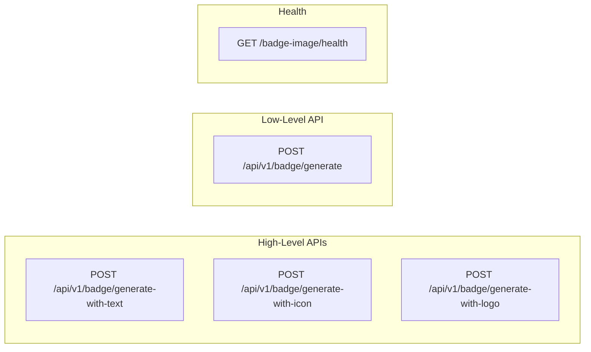

# API Reference

This document provides an overview of the Badge Image Generation API.

## Base URL

```
http://localhost:3001
```

## API Endpoints Overview



## Quick Reference

| Endpoint | Method | Description |
|----------|--------|-------------|
| `/api/v1/badge/generate` | POST | Generate badge from raw layer config |
| `/api/v1/badge/generate-with-text` | POST | Generate text overlay badge |
| `/api/v1/badge/generate-with-icon` | POST | Generate icon-based badge |
| `/api/v1/badge/generate-with-logo` | POST | Generate badge with uploaded logo |
| `/badge-image/health` | GET | Health check |

## Authentication

Currently, no authentication is required. All endpoints are publicly accessible.

## Common Headers

| Header | Value | Required |
|--------|-------|----------|
| `Content-Type` | `application/json` | Yes (for POST) |
| `Accept` | `application/json` | Recommended |

## Response Format

All successful responses follow this structure:

```json
{
  "success": true,
  "message": "Badge generated successfully",
  "data": {
    "base64": "data:image/png;base64,iVBORw0KGgo..."
  },
  "config": {
    "scale_factor": 2.0,
    "layers": [...]
  }
}
```

## Quick Start Examples

### Generate a Text Badge

```bash
curl -X POST http://localhost:3001/api/v1/badge/generate-with-text \
  -H "Content-Type: application/json" \
  -d '{
    "image_type": "text_overlay",
    "short_title": "Python Expert",
    "achievement_phrase": "Master Coder",
    "image_configuration": {
      "primary_color": "#4B8BBE",
      "secondary_color": "#FFD43B",
      "shape": "hexagon"
    }
  }'
```

### Generate an Icon Badge

```bash
curl -X POST http://localhost:3001/api/v1/badge/generate-with-icon \
  -H "Content-Type: application/json" \
  -d '{
    "image_type": "icon_based",
    "badge_name": "Science Achievement",
    "badge_description": "Completed all chemistry experiments",
    "image_configuration": {
      "primary_color": "#06D6A0",
      "shape": "circle"
    }
  }'
```

### Generate with Raw Config

```bash
curl -X POST http://localhost:3001/api/v1/badge/generate \
  -H "Content-Type: application/json" \
  -d '{
    "layers": [
      {
        "type": "ShapeLayer",
        "shape": "hexagon",
        "fill": {"mode": "solid", "color": "#4B8BBE"},
        "params": {"radius": 250},
        "z": 10
      },
      {
        "type": "TextLayer",
        "text": "Hello",
        "font": {"path": "assets/fonts/Arimo-Regular.ttf", "size": 45},
        "color": "#FFFFFF",
        "align": {"x": "center", "y": "center"},
        "z": 30
      }
    ],
    "scale_factor": 2.0
  }'
```

## Documentation

- [Endpoints](./endpoints.md) - Detailed endpoint documentation
- [Request Schemas](./request-schemas.md) - Request model reference
- [Response Schemas](./response-schemas.md) - Response model reference
- [Error Handling](./error-handling.md) - Error codes and handling

## Interactive Documentation

Swagger UI is available at:

```
http://localhost:3001/badge-image/docs
```
