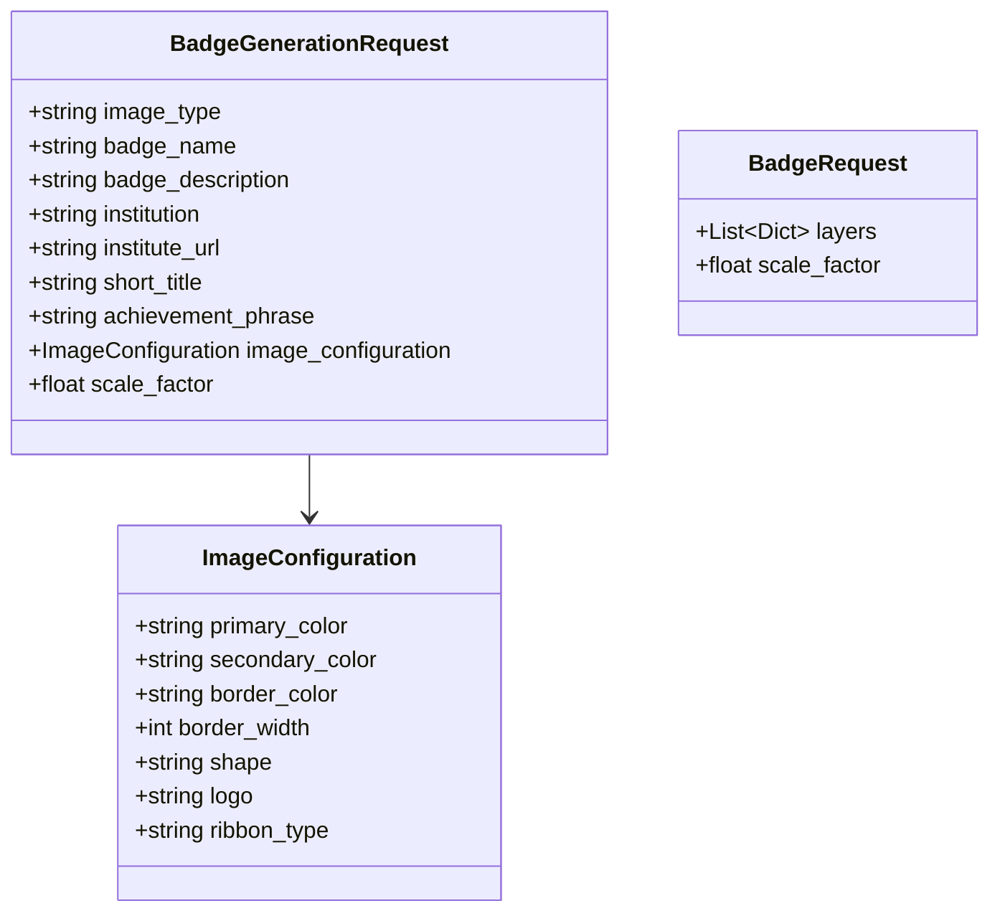

# Request Schemas

This document describes all request models used by the API.

## Model Hierarchy



## BadgeRequest

**Used by**: `POST /api/v1/badge/generate`

Low-level request model for direct layer configuration.

```json
{
  "layers": [
    {
      "type": "ShapeLayer",
      "shape": "hexagon",
      "fill": { "mode": "solid", "color": "#4B8BBE" },
      "params": { "radius": 250 },
      "z": 10
    }
  ],
  "scale_factor": 2.0
}
```

### Properties

| Property | Type | Required | Default | Description |
|----------|------|----------|---------|-------------|
| `layers` | array | Yes | - | Array of layer configurations |
| `scale_factor` | number | No | `2.0` | Output scale (1.0-3.0) |

### Validation

- `scale_factor` must be between 1.0 and 3.0

---

## BadgeGenerationRequest

**Used by**: `POST /api/v1/badge/generate-with-text`, `POST /api/v1/badge/generate-with-icon`

Unified high-level request model.

```json
{
  "image_type": "text_overlay",
  "badge_name": "Python Expert",
  "badge_description": "Mastered Python fundamentals",
  "institution": "MIT",
  "institute_url": "https://mit.edu",
  "short_title": "Python Expert",
  "achievement_phrase": "Code Master",
  "image_configuration": {
    "primary_color": "#A31F34",
    "secondary_color": "#8A8B8C",
    "border_color": "#000000",
    "border_width": 6,
    "shape": "hexagon",
    "logo": "",
    "ribbon_type": "ribbon_folded"
  },
  "scale_factor": 2.0
}
```

### Properties

| Property | Type | Required | Default | Description |
|----------|------|----------|---------|-------------|
| `image_type` | string | Yes | - | `"text_overlay"` or `"icon_based"` |
| `badge_name` | string | Conditional | `null` | Required for `icon_based` |
| `badge_description` | string | Conditional | `null` | Required for `icon_based` |
| `institution` | string | No | `null` | Institution name |
| `institute_url` | string | No | `null` | URL for color scraping |
| `short_title` | string | Conditional | `null` | Required for `text_overlay` |
| `achievement_phrase` | string | No | `""` | Achievement text |
| `image_configuration` | object | Yes | - | Image styling configuration |
| `scale_factor` | number | No | `2.0` | Output scale (1.0-3.0) |

### Validation

- `image_type` must be `"text_overlay"` or `"icon_based"`
- `scale_factor` must be between 1.0 and 3.0
- For `text_overlay`: `short_title` is required
- For `icon_based`: `badge_name` and `badge_description` are required

---

## ImageConfiguration

Nested configuration for image styling.

```json
{
  "primary_color": "#A31F34",
  "secondary_color": "#8A8B8C",
  "border_color": "#000000",
  "border_width": 6,
  "shape": "hexagon",
  "logo": "data:image/png;base64,...",
  "ribbon_type": "ribbon_folded"
}
```

### Properties

| Property | Type | Required | Default | Description |
|----------|------|----------|---------|-------------|
| `primary_color` | string | No | `null` | Primary hex color |
| `secondary_color` | string | No | `null` | Secondary hex color |
| `border_color` | string | No | `null` | Border hex color |
| `border_width` | integer | No | `0` | Border width in pixels |
| `shape` | string | No | `null` | Shape type |
| `logo` | string | No | `""` | Base64 encoded logo |
| `ribbon_type` | string | No | `null` | Ribbon style |

### Shape Options

| Value | Description |
|-------|-------------|
| `"hexagon"` | Regular hexagon |
| `"circle"` | Circle |
| `"rounded_rect"` | Rounded rectangle |

### Ribbon Type Options

| Value | Description |
|-------|-------------|
| `"ribbon"` | Classic ribbon with V-notch tails |
| `"ribbon_folded"` | 3D folded ribbon effect |
| `"none"` | No ribbon |
| `null` | Random (50% chance) |

---

## Layer Configuration Schemas

### Common Layer Properties

All layers share these properties:

| Property | Type | Required | Description |
|----------|------|----------|-------------|
| `type` | string | Yes | Layer type name |
| `z` | integer | Yes | Z-index (render order) |

### BackgroundLayer

```json
{
  "type": "BackgroundLayer",
  "mode": "solid",
  "color": "#FFFFFF00",
  "z": 0
}
```

| Property | Type | Values | Default |
|----------|------|--------|---------|
| `mode` | string | `"solid"`, `"transparent"` | `"solid"` |
| `color` | string | Hex color | `"#FFFFFF"` |

### ShapeLayer

```json
{
  "type": "ShapeLayer",
  "shape": "hexagon",
  "fill": {
    "mode": "gradient",
    "start_color": "#FFD700",
    "end_color": "#FF4500",
    "vertical": true
  },
  "border": {
    "color": "#800000",
    "width": 6
  },
  "params": {
    "radius": 250
  },
  "z": 10
}
```

| Property | Type | Description |
|----------|------|-------------|
| `shape` | string | Shape type |
| `fill` | object | Fill configuration |
| `border` | object | Border configuration |
| `params` | object | Shape-specific parameters |

#### Fill Configuration

**Solid**:
```json
{"mode": "solid", "color": "#FFD700"}
```

**Gradient**:
```json
{
  "mode": "gradient",
  "start_color": "#FFD700",
  "end_color": "#FF4500",
  "vertical": true
}
```

#### Shape Parameters

| Shape | Parameters |
|-------|------------|
| `hexagon` | `radius` |
| `circle` | `radius` |
| `rounded_rect` | `width`, `height`, `radius` |
| `shield` | `margin`, `corner_radius`, `tip_height` |
| `ribbon` | `width`, `height`, `tail_depth`, `y_offset` |
| `ribbon_folded` | `width`, `height`, `y_offset`, `fold_darken` |

### LogoLayer / ImageLayer

```json
{
  "type": "LogoLayer",
  "path": "assets/logos/wgu_logo.png",
  "size": {
    "dynamic": true
  },
  "position": {
    "x": "center",
    "y": "dynamic"
  },
  "z": 20
}
```

| Property | Type | Description |
|----------|------|-------------|
| `path` | string | Path to image file |
| `size` | object | Size configuration |
| `position` | object | Position configuration |

#### Size Options

| Property | Type | Description |
|----------|------|-------------|
| `dynamic` | boolean | Auto-calculate based on shape |
| `width` | integer | Fixed width in pixels |
| `height` | integer | Fixed height in pixels |

#### Position Options

| Property | Values |
|----------|--------|
| `x` | `"center"`, `"left"`, `"right"`, number |
| `y` | `"center"`, `"top"`, `"bottom"`, `"dynamic"`, number |

### TextLayer

```json
{
  "type": "TextLayer",
  "text": "Python Expert",
  "font": {
    "path": "assets/fonts/Arimo-Bold.ttf",
    "size": 45
  },
  "color": "#FFFFFF",
  "align": {
    "x": "center",
    "y": "dynamic"
  },
  "wrap": {
    "dynamic": true,
    "line_gap": 6
  },
  "z": 30
}
```

| Property | Type | Description |
|----------|------|-------------|
| `text` | string | Text content |
| `font` | object | Font configuration |
| `color` | string | Text color (hex) |
| `align` | object | Alignment configuration |
| `wrap` | object | Text wrapping configuration |

#### Font Configuration

| Property | Type | Default |
|----------|------|---------|
| `path` | string | System font |
| `size` | integer | `45` |

#### Alignment Options

| Property | Values |
|----------|--------|
| `x` | `"left"`, `"center"`, `"right"`, number |
| `y` | `"top"`, `"center"`, `"bottom"`, `"dynamic"`, number |

#### Wrap Configuration

| Property | Type | Description |
|----------|------|-------------|
| `dynamic` | boolean | Auto-wrap within shape bounds |
| `line_gap` | integer | Gap between lines in pixels |

---

## Complete Request Examples

### Text Overlay Badge

```json
{
  "image_type": "text_overlay",
  "short_title": "Data Science Expert",
  "institution": "Stanford University",
  "achievement_phrase": "Analytics Master",
  "institute_url": "https://stanford.edu",
  "image_configuration": {
    "primary_color": "#8C1515",
    "secondary_color": "#2E2D29",
    "border_color": "#B1040E",
    "border_width": 4,
    "shape": "hexagon",
    "ribbon_type": "ribbon_folded"
  },
  "scale_factor": 2.0
}
```

### Icon-Based Badge

```json
{
  "image_type": "icon_based",
  "badge_name": "Scientific Research",
  "badge_description": "Completed advanced laboratory research in molecular biology",
  "institution": "Harvard",
  "image_configuration": {
    "primary_color": "#A51C30",
    "secondary_color": "#1E1E1E",
    "shape": "circle"
  },
  "scale_factor": 2.0
}
```

### Raw Layer Configuration

```json
{
  "layers": [
    {
      "type": "BackgroundLayer",
      "mode": "solid",
      "color": "#FFFFFF00",
      "z": 0
    },
    {
      "type": "ShapeLayer",
      "shape": "hexagon",
      "fill": {
        "mode": "gradient",
        "start_color": "#4B8BBE",
        "end_color": "#306998",
        "vertical": true
      },
      "border": {"color": "#FFD43B", "width": 6},
      "params": {"radius": 250},
      "z": 10
    },
    {
      "type": "LogoLayer",
      "path": "assets/logos/mit_logo.webp",
      "size": {"dynamic": true},
      "position": {"x": "center", "y": "dynamic"},
      "z": 20
    },
    {
      "type": "TextLayer",
      "text": "Python Expert",
      "font": {"path": "assets/fonts/Arimo-Bold.ttf", "size": 45},
      "color": "#FFFFFF",
      "align": {"x": "center", "y": "dynamic"},
      "wrap": {"dynamic": true, "line_gap": 6},
      "z": 30
    }
  ],
  "scale_factor": 2.0
}
```
