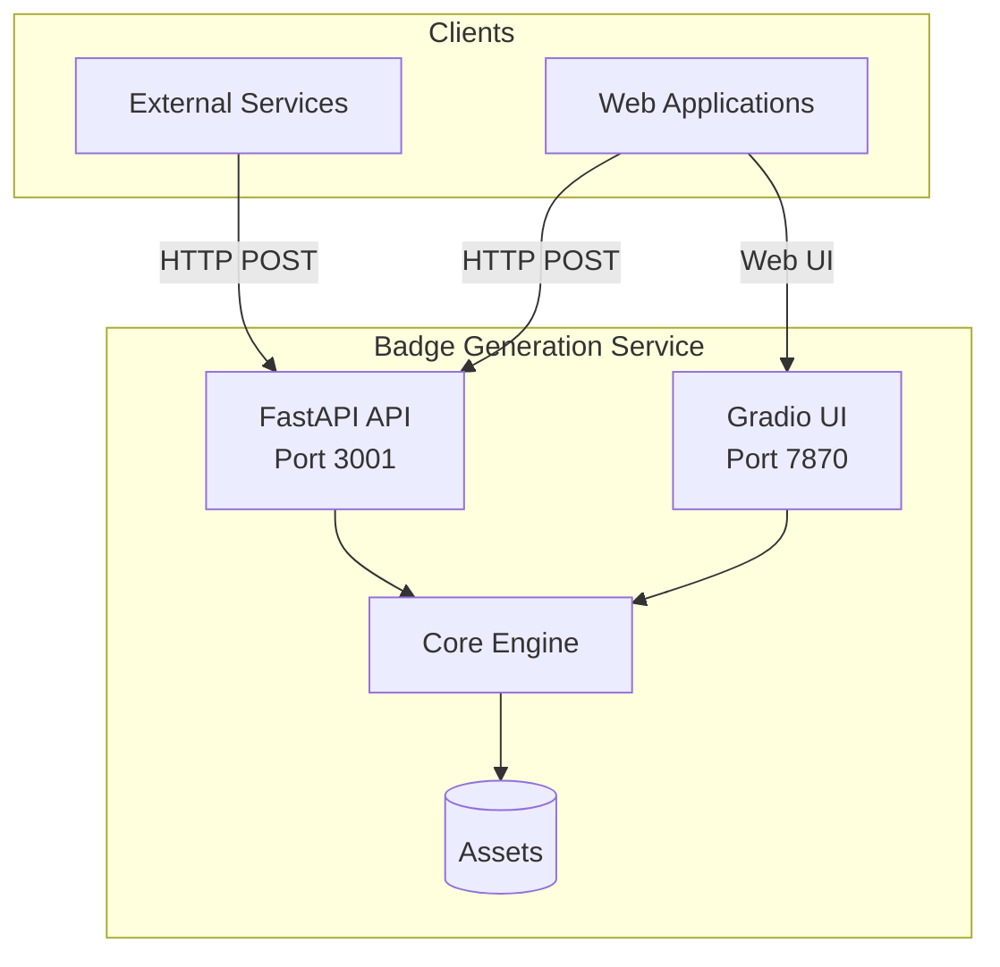
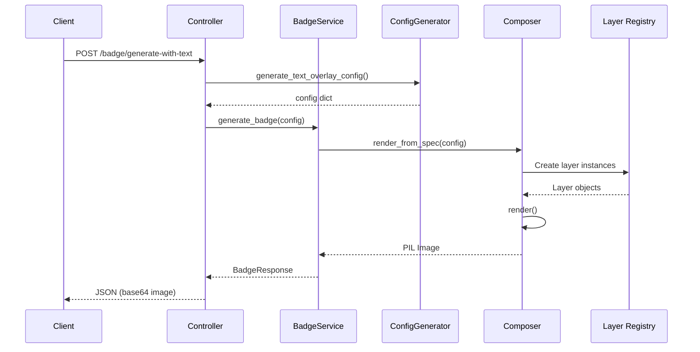

# Architecture Overview

This document describes the high-level architecture of the Badge Image Generation service.

## System Context



## Request Flow



## Directory Structure

```
app/
├── main.py                 # FastAPI entry point
├── settings.py             # Pydantic configuration
├── controllers/            # API route handlers
│   ├── badge_image.py      # Badge generation endpoints
│   └── health.py           # Health check endpoint
├── core/                   # Core rendering engine
│   ├── composer.py         # Main Composer class
│   ├── layers/             # Layer implementations
│   │   ├── __init__.py     # LAYER_REGISTRY
│   │   ├── base.py         # Abstract Layer class
│   │   ├── background.py   # BackgroundLayer
│   │   ├── shape.py        # ShapeLayer
│   │   ├── text.py         # TextLayer
│   │   └── image.py        # ImageLayer, LogoLayer
│   └── utils/              # Utility functions
│       ├── geometry.py     # Shape calculations
│       ├── text.py         # Font loading, alignment
│       └── image_processing.py  # Gradients, masks
├── services/               # Business logic
│   ├── badge_service.py    # Badge generation orchestration
│   ├── config_generator.py # Config generation
│   └── web_color_scraper.py # Color extraction
├── models/                 # Pydantic models
│   ├── requests.py         # Request schemas
│   └── responses.py        # Response schemas
└── utils/
    └── icon_matcher.py     # AI icon matching
```

## Core Components

### 1. Controllers (`app/controllers/`)

Handle HTTP requests and route to appropriate services.

| File | Purpose |
|------|---------|
| `badge_image.py` | Badge generation endpoints |
| `health.py` | Health check endpoint |

### 2. Core Engine (`app/core/`)

The rendering engine using a layer-based composition pattern.

| Component | Purpose |
|-----------|---------|
| `Composer` | Orchestrates layer rendering |
| `Layer Registry` | Maps layer types to classes |
| `Layers` | Individual layer implementations |
| `Utils` | Geometry, text, and image processing |

### 3. Services (`app/services/`)

Business logic and orchestration.

| Service | Purpose |
|---------|---------|
| `BadgeService` | Main generation orchestrator |
| `ConfigGenerator` | Creates layer configs from parameters |
| `WebColorScraper` | Extracts colors from URLs |

### 4. Models (`app/models/`)

Pydantic models for request/response validation.

## Technology Stack

| Component | Technology |
|-----------|------------|
| Framework | FastAPI |
| Server | Uvicorn |
| Image Processing | Pillow (PIL) |
| Validation | Pydantic 2.x |
| AI/ML | sentence-transformers |
| UI | Gradio |

## Related Documentation

- [Layer System](./layer-system.md) - Detailed layer types documentation
- [Rendering Pipeline](./rendering-pipeline.md) - Step-by-step rendering flow
- [Services](./services.md) - Service layer documentation
