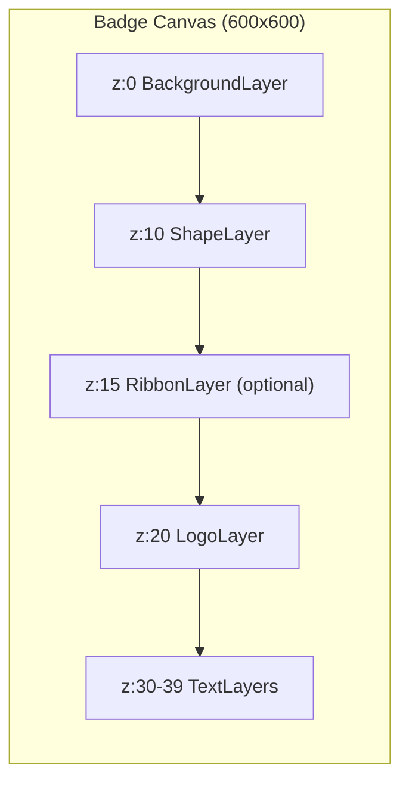

# Layer System

The badge generation system uses a **layer-based architecture** similar to image editing software. Badges are composed by stacking multiple layers, each rendered in z-index order.

## Layer Composition



## Layer Registry

Located in `app/core/layers/__init__.py`:

```python
LAYER_REGISTRY = {
    "BackgroundLayer": BackgroundLayer,
    "ShapeLayer": ShapeLayer,
    "ImageLayer": ImageLayer,
    "LogoLayer": LogoLayer,
    "TextLayer": TextLayer,
}
```

## Layer Types

### 1. BackgroundLayer

Renders a solid color or transparent background.

**File**: `app/core/layers/background.py`

| Property | Type | Default | Description |
|----------|------|---------|-------------|
| `mode` | string | `"solid"` | `"solid"` or `"transparent"` |
| `color` | string | `"#FFFFFF"` | Hex color code |
| `z` | number | `0` | Z-index (render order) |

**Example**:
```json
{
  "type": "BackgroundLayer",
  "mode": "solid",
  "color": "#FFFFFF00",
  "z": 0
}
```

### 2. ShapeLayer

Renders geometric shapes with optional fill and border.

**File**: `app/core/layers/shape.py`

| Property | Type | Default | Description |
|----------|------|---------|-------------|
| `shape` | string | `"hexagon"` | Shape type |
| `fill` | object | `{}` | Fill configuration |
| `border` | object | `{}` | Border configuration |
| `params` | object | `{}` | Shape-specific parameters |
| `z` | number | `10` | Z-index |

#### Supported Shapes

| Shape | Description | Key Parameters |
|-------|-------------|----------------|
| `hexagon` | Regular hexagon | `radius` |
| `circle` | Circle | `radius` |
| `rounded_rect` | Rounded rectangle | `width`, `height`, `radius` |
| `shield` | Shield/badge shape | `margin`, `corner_radius`, `tip_height` |
| `ribbon` | Banner with V-notch tails | `width`, `height`, `tail_depth`, `y_offset` |
| `ribbon_folded` | 3D folded ribbon | `width`, `height`, `y_offset`, `fold_darken` |

#### Fill Modes

**Solid Fill**:
```json
{
  "fill": {
    "mode": "solid",
    "color": "#FFD700"
  }
}
```

**Gradient Fill**:
```json
{
  "fill": {
    "mode": "gradient",
    "start_color": "#FFD700",
    "end_color": "#FF4500",
    "vertical": true
  }
}
```

#### Border Configuration

```json
{
  "border": {
    "color": "#800000",
    "width": 6
  }
}
```

**Example - Hexagon with Gradient**:
```json
{
  "type": "ShapeLayer",
  "shape": "hexagon",
  "fill": {
    "mode": "gradient",
    "start_color": "#FFD700",
    "end_color": "#FF4500",
    "vertical": true
  },
  "border": {
    "color": "#800000",
    "width": 6
  },
  "params": {
    "radius": 250
  },
  "z": 10
}
```

**Example - Ribbon**:
```json
{
  "type": "ShapeLayer",
  "shape": "ribbon_folded",
  "fill": {
    "mode": "solid",
    "color": "#C41E3A"
  },
  "params": {
    "width": 480,
    "height": 80,
    "y_offset": 180,
    "fold_darken": 0.8
  },
  "z": 15
}
```

### 3. LogoLayer / ImageLayer

Renders images (logos, icons) with dynamic positioning.

**File**: `app/core/layers/image.py`

| Property | Type | Default | Description |
|----------|------|---------|-------------|
| `path` | string | required | Path to image file |
| `size` | object | `{}` | Size configuration |
| `position` | object | `{}` | Position configuration |
| `z` | number | `20` | Z-index |

#### Size Configuration

| Property | Type | Description |
|----------|------|-------------|
| `dynamic` | boolean | Auto-calculate size based on shape |
| `width` | number | Fixed width in pixels |
| `height` | number | Fixed height in pixels |

#### Position Configuration

| Property | Type | Description |
|----------|------|-------------|
| `x` | string/number | `"center"`, `"left"`, `"right"`, or pixels |
| `y` | string/number | `"center"`, `"top"`, `"bottom"`, `"dynamic"`, or pixels |

**Example**:
```json
{
  "type": "LogoLayer",
  "path": "assets/logos/wgu_logo.png",
  "size": {
    "dynamic": true
  },
  "position": {
    "x": "center",
    "y": "dynamic"
  },
  "z": 20
}
```

### 4. TextLayer

Renders text with dynamic wrapping and positioning.

**File**: `app/core/layers/text.py`

| Property | Type | Default | Description |
|----------|------|---------|-------------|
| `text` | string | required | Text content |
| `font` | object | `{}` | Font configuration |
| `color` | string | `"#000000"` | Text color |
| `align` | object | `{}` | Alignment configuration |
| `wrap` | object | `{}` | Text wrapping configuration |
| `z` | number | `30` | Z-index |

#### Font Configuration

| Property | Type | Default | Description |
|----------|------|---------|-------------|
| `path` | string | System default | Path to TTF font file |
| `size` | number | `45` | Font size in pixels |

#### Alignment Configuration

| Property | Values | Description |
|----------|--------|-------------|
| `x` | `"left"`, `"center"`, `"right"`, number | Horizontal alignment |
| `y` | `"top"`, `"center"`, `"bottom"`, `"dynamic"`, number | Vertical alignment |

#### Wrap Configuration

| Property | Type | Description |
|----------|------|-------------|
| `dynamic` | boolean | Auto-wrap within shape bounds |
| `line_gap` | number | Gap between lines in pixels |

**Example**:
```json
{
  "type": "TextLayer",
  "text": "Python Expert",
  "font": {
    "path": "assets/fonts/Arimo-Bold.ttf",
    "size": 45
  },
  "color": "#FFFFFF",
  "align": {
    "x": "center",
    "y": "dynamic"
  },
  "wrap": {
    "dynamic": true,
    "line_gap": 6
  },
  "z": 30
}
```

## Dynamic Positioning

The system supports dynamic positioning for logos and text within shapes:

| Position | Calculation |
|----------|-------------|
| Logo center | 25% from shape top |
| Title text | 46% from shape top |
| Subtitle | 66% from shape top |
| Skill badge | 25% below center |

Dynamic text wrapping calculates available width at each Y position using `get_shape_width_at_y()`.

## Scale Factor

All dimensions are multiplied by `scale_factor`:

| Scale Factor | Canvas Size | Use Case |
|--------------|-------------|----------|
| 1.0 | 600x600 | Preview |
| 2.0 (default) | 1200x1200 | Standard output |
| 3.0 | 1800x1800 | High resolution |

## Complete Badge Example

```json
{
  "canvas": {
    "scale_factor": 2.0
  },
  "layers": [
    {
      "type": "BackgroundLayer",
      "mode": "solid",
      "color": "#FFFFFF00",
      "z": 0
    },
    {
      "type": "ShapeLayer",
      "shape": "hexagon",
      "fill": {
        "mode": "gradient",
        "start_color": "#4B8BBE",
        "end_color": "#306998",
        "vertical": true
      },
      "border": {
        "color": "#FFD43B",
        "width": 6
      },
      "params": {
        "radius": 250
      },
      "z": 10
    },
    {
      "type": "LogoLayer",
      "path": "assets/logos/mit_logo.webp",
      "size": {"dynamic": true},
      "position": {"x": "center", "y": "dynamic"},
      "z": 20
    },
    {
      "type": "TextLayer",
      "text": "Python Expert",
      "font": {"path": "assets/fonts/Arimo-Bold.ttf", "size": 45},
      "color": "#FFFFFF",
      "align": {"x": "center", "y": "dynamic"},
      "wrap": {"dynamic": true, "line_gap": 6},
      "z": 30
    },
    {
      "type": "TextLayer",
      "text": "Mastering the Basics",
      "font": {"path": "assets/fonts/Arimo-Regular.ttf", "size": 28},
      "color": "#FFD43B",
      "align": {"x": "center", "y": "dynamic"},
      "wrap": {"dynamic": true, "line_gap": 4},
      "z": 31
    }
  ]
}
```
