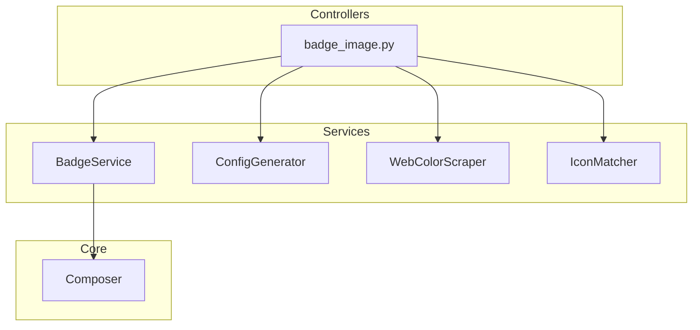
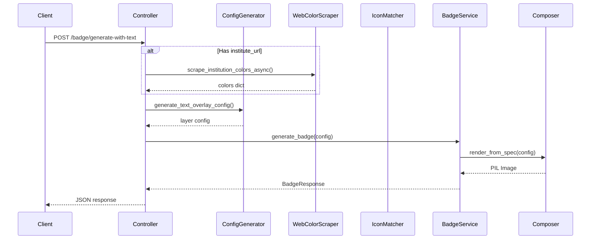

# Services Documentation

This document describes the service layer that handles business logic and orchestration.

## Service Architecture



## BadgeService

**File**: `app/services/badge_service.py`

The main orchestration service for badge generation.

### Methods

#### `generate_badge(config: Dict) -> BadgeResponse`

Generates a badge image from configuration.

```python
async def generate_badge(self, config: Dict[str, Any]) -> BadgeResponse:
    """
    Generate a badge image from configuration

    Args:
        config: Badge configuration dictionary

    Returns:
        BadgeResponse with base64 encoded image
    """
```

**Process**:
1. Add fixed canvas dimensions (600x600)
2. Add default background layer if missing
3. Call `render_from_spec()` to generate PIL Image
4. Convert image to base64 PNG
5. Return `BadgeResponse` with data URI

**Response Format**:
```json
{
  "success": true,
  "message": "Badge generated successfully",
  "data": {
    "base64": "data:image/png;base64,..."
  },
  "config": { ... }
}
```

## ConfigGenerator

**File**: `app/services/config_generator.py`

Generates layer configurations from high-level parameters.

### Functions

#### `generate_text_overlay_config()`

Creates configuration for text-based badges.

```python
def generate_text_overlay_config(
    short_title: str,
    institute: str = "",
    achievement_phrase: str = "",
    colors: Optional[dict] = None,
    border_color: Optional[str] = None,
    border_width: Optional[int] = None,
    shape: Optional[str] = None,
    seed: Optional[int] = None,
    ribbon_type: Optional[str] = None
) -> Dict[str, Any]
```

**Parameters**:

| Parameter | Type | Default | Description |
|-----------|------|---------|-------------|
| `short_title` | string | required | Badge title text |
| `institute` | string | `""` | Institution name |
| `achievement_phrase` | string | `""` | Achievement phrase |
| `colors` | dict | `None` | Brand colors (primary, secondary, tertiary) |
| `border_color` | string | `None` | Border color hex code |
| `border_width` | int | `None` | Border width in pixels |
| `shape` | string | `None` | `"hexagon"`, `"circle"`, or `"rounded_rect"` |
| `seed` | int | `None` | Random seed for reproducibility |
| `ribbon_type` | string | `None` | `"ribbon"`, `"ribbon_folded"`, `"none"`, or `None` (random) |

**Generated Layers**:
- BackgroundLayer (transparent)
- ShapeLayer (with gradient fill)
- LogoLayer (dynamic positioning)
- RibbonLayer (optional, 50% chance if not specified)
- TextLayers (title and subtitle)

#### `generate_icon_based_config()`

Creates configuration for icon-based badges.

```python
def generate_icon_based_config(
    icon_name: str,
    colors: Optional[dict] = None,
    seed: Optional[int] = None
) -> Dict[str, Any]
```

**Parameters**:

| Parameter | Type | Default | Description |
|-----------|------|---------|-------------|
| `icon_name` | string | required | Icon filename (e.g., `"atom.png"`) |
| `colors` | dict | `None` | Brand colors |
| `seed` | int | `None` | Random seed |

### Gradient Schemes

The service includes 12 curated gradient schemes:

```python
GRADIENT_SCHEMES = [
    # Warm gradients
    {"start": "#FF6F61", "end": "#FFB703", "category": "warm"},      # Coral to Gold
    {"start": "#FB8500", "end": "#FFF4CC", "category": "warm"},      # Dark orange to cream
    {"start": "#FF6F61", "end": "#FFD9B3", "category": "warm"},      # Coral to peach
    {"start": "#FFD9B3", "end": "#FFB703", "category": "warm"},      # Peach to Gold

    # Cool gradients
    {"start": "#26547C", "end": "#B3E5FC", "category": "cool"},      # Navy to sky blue
    {"start": "#118AB2", "end": "#06D6A0", "category": "cool"},      # Deep blue to turquoise
    {"start": "#26547C", "end": "#E1BEE7", "category": "cool"},      # Navy to lavender
    {"start": "#457B9D", "end": "#B3E5FC", "category": "cool"},      # Blue to sky blue

    # Cross-family transitions
    {"start": "#FFB703", "end": "#06D6A0", "category": "warm-cool"}, # Gold to mint
    {"start": "#FF8C42", "end": "#2A9D8F", "category": "warm-cool"}, # Orange to teal
    {"start": "#26547C", "end": "#FFF4CC", "category": "cool-warm"}, # Navy to cream
    {"start": "#06D6A0", "end": "#FFD9B3", "category": "cool-warm"}, # Turquoise to peach
]
```

### Color Utilities

#### `_get_luminance(hex_color)`

Calculates WCAG relative luminance for accessibility.

```python
def _get_luminance(hex_color: str) -> float:
    """Calculate WCAG relative luminance (0=dark, 1=bright)"""
```

#### `_get_complementary_text_color()`

Selects text color based on background luminance:

| Luminance | Text Color |
|-----------|------------|
| < 0.3 | Light (white/cream) |
| 0.3 - 0.5 | Contrasting palette color |
| > 0.5 | Dark (black/navy) |

## WebColorScraper

**File**: `app/services/web_color_scraper.py`

Extracts brand colors from institution websites.

### Functions

#### `scrape_institution_colors_async(url)`

```python
async def scrape_institution_colors_async(url: str) -> Dict[str, str]:
    """
    Scrape institution colors from website

    Args:
        url: Institution website URL

    Returns:
        Dict with primary, secondary, tertiary colors
    """
```

**Example Response**:
```json
{
  "primary": "#A31F34",
  "secondary": "#8A8B8C",
  "tertiary": "#C2C0BF"
}
```

## IconMatcher

**File**: `app/utils/icon_matcher.py`

AI-based icon matching using sentence transformers.

### Functions

#### `get_icon_suggestions_for_badge()`

```python
async def get_icon_suggestions_for_badge(
    badge_name: str,
    badge_description: str,
    top_k: int = 3
) -> Dict[str, Any]:
    """
    Suggest icons based on badge name and description

    Args:
        badge_name: Name of the badge
        badge_description: Description of the badge
        top_k: Number of suggestions to return

    Returns:
        Dict with suggested_icon and alternatives
    """
```

**Model**: `sentence-transformers/all-MiniLM-L6-v2`

**Example Response**:
```json
{
  "suggested_icon": {
    "name": "atom.png",
    "score": 0.85
  },
  "alternatives": [
    {"name": "microscope.png", "score": 0.72},
    {"name": "dna.png", "score": 0.68}
  ]
}
```

## Service Integration Flow



## Configuration Examples

### Text Badge with Custom Colors

```python
config = generate_text_overlay_config(
    short_title="Python Expert",
    institute="MIT",
    achievement_phrase="Code with Confidence",
    colors={
        "primary": "#A31F34",
        "secondary": "#8A8B8C"
    },
    border_color="#000000",
    border_width=6,
    shape="hexagon",
    ribbon_type="ribbon_folded"
)
```

### Icon Badge

```python
config = generate_icon_based_config(
    icon_name="atom.png",
    colors={
        "primary": "#4B8BBE",
        "secondary": "#FFD43B"
    },
    seed=12345
)
```
