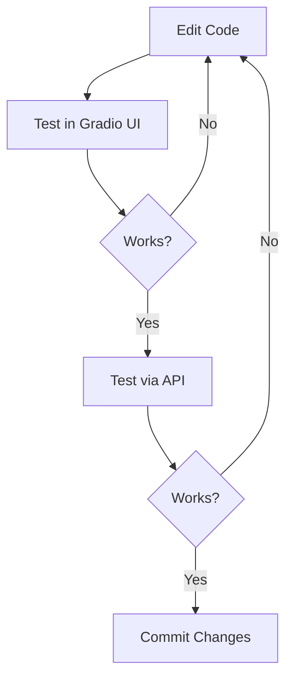

# Development Workflow

This guide covers the local development workflow for the Badge Image Generation service.

## Starting the Services

### FastAPI Server (Production API)

```bash
# From project root
python -m app.main
```

Server runs at: `http://localhost:3001`

### Gradio Interface (Development UI)

```bash
# From project root
python tools/gradio_main.py
```

UI available at: `http://localhost:7870`

### Both Services

```bash
# Terminal 1
python -m app.main

# Terminal 2
python tools/gradio_main.py
```

## Development Cycle



## Testing Methods

### 1. Gradio Interface

The Gradio interface provides real-time visual feedback:

1. Navigate to `http://localhost:7870`
2. Edit the JSON configuration in the editor
3. Click "Generate Badge"
4. View the rendered badge immediately

### 2. Swagger UI

Interactive API testing:

1. Navigate to `http://localhost:3001/badge-image/docs`
2. Expand an endpoint
3. Click "Try it out"
4. Modify the request body
5. Click "Execute"

### 3. cURL Commands

Test from command line:

```bash
# Health check
curl http://localhost:3001/badge-image/health

# Generate text badge
curl -X POST http://localhost:3001/api/v1/badge/generate-with-text \
  -H "Content-Type: application/json" \
  -d '{
    "image_type": "text_overlay",
    "short_title": "Test Badge",
    "image_configuration": {
      "shape": "hexagon"
    }
  }'
```

### 4. Python Scripts

Create test scripts:

```python
import requests
import base64

# Generate badge
response = requests.post(
    'http://localhost:3001/api/v1/badge/generate-with-text',
    json={
        'image_type': 'text_overlay',
        'short_title': 'Test Badge',
        'image_configuration': {'shape': 'hexagon'}
    }
)

data = response.json()
print(f"Success: {data['success']}")

# Save image
if data['success']:
    base64_data = data['data']['base64'].split(',')[1]
    with open('test_badge.png', 'wb') as f:
        f.write(base64.b64decode(base64_data))
    print("Saved to test_badge.png")
```

## Adding New Features

### Adding a New Layer Type

1. Create the layer class in `app/core/layers/`:

```python
# app/core/layers/my_layer.py
from app.core.layers.base import Layer

class MyLayer(Layer):
    def __init__(self, spec):
        super().__init__(spec)
        self.my_property = spec.get("my_property", "default")

    def render(self, canvas):
        # Implement rendering logic
        pass
```

2. Register in `app/core/layers/__init__.py`:

```python
from app.core.layers.my_layer import MyLayer

LAYER_REGISTRY = {
    # ... existing layers
    "MyLayer": MyLayer,
}
```

3. Test in Gradio with a JSON config:

```json
{
  "layers": [
    {
      "type": "MyLayer",
      "my_property": "value",
      "z": 10
    }
  ]
}
```

### Adding a New Shape

1. Add shape logic in `app/core/layers/shape.py`:

```python
def _mask(self, size):
    # ... existing shapes
    if s == "my_shape":
        # Create and return mask
        return my_shape_mask(size, self.params)
```

2. Add border rendering (if applicable):

```python
def render(self, canvas):
    # ... in border section
    elif s == "my_shape":
        # Draw border for my_shape
```

### Adding a New Endpoint

1. Add route in `app/controllers/badge_image.py`:

```python
@router.post("/badge/my-endpoint", response_model=BadgeResponse)
async def my_endpoint(request: MyRequest):
    """Docstring for Swagger"""
    # Implementation
```

2. Add request model in `app/models/requests.py`:

```python
class MyRequest(BaseModel):
    field: str = Field(description="Description")
```

## Code Style

### Python Conventions

- Use type hints for function parameters and returns
- Add docstrings to public functions
- Follow PEP 8 style guidelines

```python
def generate_config(
    title: str,
    colors: Optional[Dict[str, str]] = None
) -> Dict[str, Any]:
    """
    Generate badge configuration.

    Args:
        title: Badge title text
        colors: Optional color dictionary

    Returns:
        Complete badge configuration
    """
```

### Import Organization

```python
# Standard library
import json
import base64

# Third-party
from fastapi import APIRouter
from PIL import Image

# Local
from app.core.layers import LAYER_REGISTRY
from app.models.requests import BadgeRequest
```

## Debugging

### Enable Debug Logging

The service logs to `logs/` directory. Check logs for errors:

```bash
tail -f logs/badge_service.log
```

### Common Debug Points

1. **Layer creation**: Check `LAYER_REGISTRY` mapping
2. **Rendering**: Check individual layer `render()` methods
3. **Dynamic positioning**: Check `_update_dynamic_positions()` in Composer
4. **Text wrapping**: Check `get_shape_width_at_y()` in geometry utils

### Using Breakpoints

```python
# Add in code for debugging
import pdb; pdb.set_trace()
```

Or use IDE debugger:
- VS Code: Set breakpoints in gutter
- PyCharm: Set breakpoints and run debug configuration

## Performance Tips

1. **Use scale_factor 1.0 during development** - Faster rendering
2. **Test with minimal layers first** - Isolate issues
3. **Cache font objects** - Fonts are already cached by PIL
4. **Use async endpoints** - All endpoints are async for performance

## Hot Reload

Uvicorn supports hot reload during development:

```bash
uvicorn app.main:app --reload --port 3001
```

Changes to Python files will automatically restart the server.

## Version Control

### Branch Naming

```
feature/add-new-shape
fix/text-wrapping-issue
docs/update-api-reference
```

### Commit Messages

```
Add ribbon_folded shape with 3D effect

- Implement _render_ribbon_folded method
- Add fold_darken parameter for depth
- Update shape registry
```

## Next Steps

- [Testing Guide](./testing.md) - Write and run tests
- [Deployment Guide](./deployment.md) - Deploy to production
