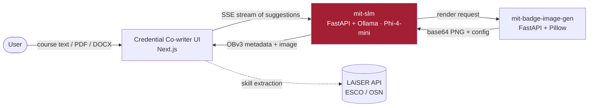

# Badge Generator API — Open Badges v3 with a local SLM

> The reasoning core of the **Credential Co-writer** — an open, AI-assisted Open Badges v3 authoring system from the [Digital Credentials Consortium](https://digitalcredentials.mit.edu/). Generates standards-compliant credential metadata from course content using a **local small language model**, on CPU, with no external LLM calls.

<p align="center">
  
</p>

<p align="center">
  <a href="LICENSE"></a>
  
  
  
  
</p>

---

## What this is

A **FastAPI** service that turns raw course content into **Open Badge v3** credential metadata — a title, a description, and a criteria narrative — by prompting a locally-served **Microsoft Phi-4-mini** model through [Ollama](https://ollama.com/). It runs entirely on CPU, supports 23 languages, streams output token-by-token, and orchestrates the badge image by calling the companion rendering service.

It is the metadata brain; it stores nothing durably (history is in-process) and makes no outbound calls except to its own model runtime and the image service it is configured to use.

## Where it fits



- **mit-slm** *(this repo)* — generates OBv3 metadata and orchestrates image rendering.
- **[mit-badge-image-gen](https://github.com/oneorigin-inc/mit-badge-image-generation)** — renders the badge image.
- **[mit-badge-front-end](https://github.com/oneorigin-inc/mit-badge-front-end)** — the authoring UI.

## Features

- **Open Badges v3 compliant** — output aligns with the 1EdTech / IMS Global specification and Verifiable Credentials.
- **Local SLM, CPU-only** — Phi-4-mini via Ollama; no GPU and no third-party LLM API required.
- **Streaming** — Server-Sent Events stream tokens as the model writes, then emit a final structured badge.
- **23 languages** — all human-readable fields can be generated in a requested BCP-47 language; identifiers and JSON keys stay in English.
- **Field regeneration** — regenerate a single field (title, description, or criteria) without redoing the whole badge.
- **Image orchestration** — proxies badge-image requests (including multipart logo uploads) to the rendering service.
- **Robust JSON extraction** — tolerant parsing of model output (smart quotes, CJK brackets, markdown fences) for reliable structured results across languages.

## Quick start

### Prerequisites
- Python 3.9+ and [Ollama](https://ollama.com/), or Docker + Docker Compose
- 8 GB RAM minimum (16 GB recommended)

### 1 — Provide the model

The default model is `phi4-chat:latest`, built from the bundled `models/Modelfile` (Phi-4-mini, Q4_K_M). Download the GGUF into `models/` and create the Ollama model:

```bash
# place Phi-4-mini-instruct_Q4_K_M.gguf in ./models/, then:
ollama create phi4-chat -f models/Modelfile
```

Any GGUF model works — point `MODEL_NAME` at it. See [Custom models](#custom-models).

### 2 — Run

```bash
# Local
python3 -m venv venv && source venv/bin/activate
pip install -r requirements.txt
uvicorn app.main:app --host 0.0.0.0 --port 8000

# or Docker (app + Ollama)
docker compose up -d
```

Open `http://localhost:8000/docs` for interactive API docs, and `GET /health` for a liveness check.

---

## API Reference

**Base URL:** `http://localhost:8000` · Interactive docs at `GET /docs`, OpenAPI JSON at `GET /openapi.json`.

**CORS:** allowed origins are an explicit, env-driven allowlist (`CORS_ORIGINS_STR`) — never a wildcard with credentials.

**Errors:** non-2xx responses use FastAPI's standard shape `{ "detail": "..." }`; validation errors (`422`) return a `detail` array of field errors.

### Endpoints summary

| Method | Path | Description |
|--------|------|-------------|
| `GET` | `/health` | Service health check |
| `POST` | `/api/v1/generate-badge-suggestions` | Generate badge metadata (sync) |
| `POST` | `/api/v1/generate-badge-suggestions/stream` | Generate badge metadata (SSE stream) |
| `POST` | `/api/v1/regenerate-field` | Regenerate one badge field |
| `POST` | `/api/v1/edit-badge-metadata` | Append data to a badge in history |
| `POST` | `/api/v1/optimize_badge_text` | Optimize title/phrase for image overlay |
| `GET` | `/api/v1/badge_history` | List in-memory badge history |
| `DELETE` | `/api/v1/badge_history` | Clear in-memory badge history |
| `GET` | `/api/v1/styles` | List style/tone/level options |
| `POST` | `/api/v1/extract-skills/{badge_id}` | **Disabled** — skills handled by frontend |
| `GET` | `/api/v1/ollama-status` | Ollama model runtime status |
| `POST` | `/api/v1/badge/generate` | Proxy to badge image service |
| `POST` | `/api/v1/badge/generate-with-logo` | Proxy to badge image service (multipart) |

> **Skill extraction:** ESCO/OSN alignment is performed by the **frontend** via an external LAiSER API. This backend does not return `skills` on badge responses. The `enable_skill_extraction` request field is accepted for compatibility but ignored.

---

### `GET /health`

Liveness check for load balancers and monitoring. No request body.

**Response `200`:**
```json
{ "status": "healthy", "timestamp": "2026-05-26T12:00:00.000000" }
```

---

### `POST /api/v1/generate-badge-suggestions`

Generates Open Badge v3 metadata from course input using the local Ollama SLM. Optionally calls the badge image service when image generation is enabled.

**Request body (`GenerateBadgeRequest`):**
```json
{
  "course_input": "Course content or learning outcomes...",
  "badge_configuration": {
    "badge_style": "Academic",
    "badge_tone": "Authoritative",
    "criterion_style": "Task-Oriented",
    "badge_level": "Beginner",
    "institution": "MIT",
    "institute_url": "https://www.mit.edu",
    "custom_instructions": "Add institute name to badge title and description.",
    "language": "en"
  },
  "enable_skill_extraction": false,
  "context_length": null,
  "image_generation": {
    "enable_image_generation": true,
    "image_configuration": {
      "image_type": "text_overlay",
      "shape": "hexagon",
      "primary_color": "#A31F34",
      "secondary_color": "#8A8B8C",
      "border_color": "#000000",
      "border_width": 4,
      "logo": "",
      "ribbon_type": "ribbon"
    }
  }
}
```

| Field | Type | Required | Description |
|-------|------|----------|-------------|
| `course_input` | string | Yes | Source text for badge generation (length-bounded) |
| `badge_configuration` | object | Yes | Style, tone, level, institution, language, etc. |
| `badge_configuration.language` | string | No | BCP-47 code (default `en`). See [Multilingual generation](#multilingual-generation) |
| `enable_skill_extraction` | boolean | No | Ignored (frontend handles skills). Default `false` |
| `context_length` | integer | No | Ollama context override (`num_ctx`), range-bounded |
| `image_generation.enable_image_generation` | boolean | No | Default `false` |
| `image_generation.image_configuration` | object | No | Required when image generation is enabled |
| `image_configuration.image_type` | string | No | `text_overlay` (default) or `icon_based` |

**Response `200` (`BadgeResponse`):**
```json
{
  "credentialSubject": {
    "achievement": {
      "name": "MIT Foundation in Python Programming: Core Competency Achieved",
      "description": "Demonstrates foundational competency...",
      "criteria": { "narrative": "The learner explains, determines, and applies..." },
      "image": {
        "id": "${BADGE_ISSUER_URL}/achievements/badge_<uuid>/image",
        "image_base64": "<base64-string-or-omitted-if-no-image>"
      }
    }
  },
  "imageConfig": null,
  "badge_id": "550e8400-e29b-41d4-a716-446655440000",
  "metrics": {
    "total_duration": 1111111111,
    "prompt_eval_count": 1200,
    "prompt_eval_duration": 123456789,
    "eval_count": 350,
    "eval_duration": 987654321
  },
  "badge_configuration": {},
  "enable_image_generation": true,
  "enable_skill_extraction": false
}
```

| Field | Type | Description |
|-------|------|-------------|
| `credentialSubject.achievement` | object | OBv3 achievement payload (`name`, `description`, `criteria.narrative`, optional `image`) |
| `imageConfig` | object \| null | Image service config metadata |
| `badge_id` | string | UUID for this generation |
| `metrics` | object \| null | Ollama token/timing metrics |
| `badge_configuration` | object | Echo of request configuration |
| `enable_image_generation` · `enable_skill_extraction` | boolean | Echo of request flags |

> The `image.id` is built from the configurable `BADGE_ISSUER_URL` — set it to your public issuer host for real issuance.

**Common errors:** `422` validation · `502` invalid model JSON · `503` Ollama or image service unavailable · `500` internal error.

---

### `POST /api/v1/generate-badge-suggestions/stream`

Same input as the sync endpoint. Streams Server-Sent Events while the model generates, then emits a final badge payload (and optionally an image).

**Request:** Same body as the sync endpoint. Send `Accept: text/event-stream`.

**Response `200`:** `Content-Type: text/plain; charset=utf-8`. Each event is one line: `data: <json>\n\n`.

| `type` | Description |
|--------|-------------|
| `token` | Partial model output (`content`, `accumulated`, `badge_id`) |
| `final` | Complete `BadgeResponse` in `content` (plus `generation_time`, `metrics`) |
| `error` | Failure (`content`, `error_code`, optional `solution`); stream may end |

```json
{ "type": "token", "content": "{\"badge_name\":", "accumulated": "{\"badge_name\":", "badge_id": "550e8400-..." }
```
```json
{ "type": "final", "content": { }, "badge_id": "550e8400-...", "generation_time": 45.2, "metrics": { "prompt_eval_count": 1261, "eval_count": 313 } }
```

`content` on the `final` event matches the sync `BadgeResponse`.

---

### `POST /api/v1/regenerate-field`

Regenerates a single field (`title`, `description`, or `criteria`) for a badge previously stored in server history.

**Request body:**
```json
{
  "badge_id": "550e8400-e29b-41d4-a716-446655440000",
  "field_to_change": "title",
  "badge_style": "Academic",
  "institution": "MIT",
  "custom_instructions": "Make the title more concise."
}
```

| Field | Type | Required | Description |
|-------|------|----------|-------------|
| `badge_id` | string | Yes | UUID from a prior generate response |
| `field_to_change` | string | Yes | `title`, `description`, or `criteria` |
| `custom_instructions` | string | No | Extra guidance for the model |
| `institution` | string | No | Institution context |
| `badge_style`, `badge_tone`, `criterion_style`, `badge_level` | string | No | Optional overrides |

**Response `200`:** Same shape as `BadgeResponse` (updated badge). **Errors:** `404` badge not in history · `500` model or merge failure.

---

### `POST /api/v1/edit-badge-metadata`

Merges arbitrary key/value data into a badge entry stored in in-memory history (used for client-side patches).

**Request body:**
```json
{ "badge_id": 1, "append_data": { "custom_field": "value", "notes": "Reviewer approved" } }
```

| Field | Type | Required | Description |
|-------|------|----------|-------------|
| `badge_id` | integer | Yes | **History entry `id`**, not the UUID `badge_id` |
| `append_data` | object | Yes | Fields to merge into the stored result |

**Response `200`:**
```json
{ "message": "Data successfully appended to badge 1", "badge_id": 1, "updated_result": { } }
```
**Errors:** `404` history entry not found · `400` entry has no result data.

---

### `POST /api/v1/optimize_badge_text`

Uses the SLM to produce short overlay strings for badge images (max 2-word title, 3-word phrase).

**Request body:**
```json
{ "badge_name": "Machine Learning Foundations", "badge_description": "Covers supervised learning, evaluation, and deployment basics.", "institution": "MIT" }
```

**Response `200`:**
```json
{ "short_title": "ML Foundations", "achievement_phrase": "Models Mastered", "metrics": { "prompt_eval_count": 200, "eval_count": 50 } }
```

---

### `GET /api/v1/badge_history`

Returns up to 50 recent generations held in process memory (cleared on restart). No request body.

**Response `200`:**
```json
{
  "history": [
    { "id": 1, "timestamp": "2026-05-26T12:00:00", "badge_id": "550e8400-...", "course_input": "Introduction to...", "result": { }, "generation_time": 42.5, "metrics": { } }
  ],
  "total_count": 1
}
```

### `DELETE /api/v1/badge_history`

Clears all in-memory history. **Response `200`:** `{ "message": "Badge history cleared successfully" }`.

---

### `GET /api/v1/styles`

Returns configurable style, tone, criterion, and level labels with prompt descriptions. No request body.

**Response `200`:**
```json
{
  "badge_styles": { "Professional": "Style Instructions: ...", "Academic": "Style Instructions: ..." },
  "badge_tones": { "Authoritative": "Confident, definitive tone...", "Encouraging": "Motivating, supportive tone..." },
  "criterion_styles": { "Task-Oriented": "The learner explains, determines..." },
  "badge_levels": { "Beginner": "Target learners with minimal prior knowledge...", "Intermediate": "...", "Advanced": "..." }
}
```

---

### `POST /api/v1/extract-skills/{badge_id}`

**Disabled.** Skill extraction is handled by the frontend LAiSER API. Accepts a `badge_id` path param and an optional `top_k` query param (ignored).

**Response `503`:**
```json
{ "detail": "Backend LAiSER skill extraction is disabled. Skill extraction is handled by the frontend." }
```

---

### `GET /api/v1/ollama-status`

Proxies Ollama's `/api/ps` and `/api/tags` for debugging model load state. No request body.

**Response `200`:**
```json
{ "status": "success", "ollama_url": "http://ollama:11434", "running_models": { "models": [] }, "available_models": { "models": [] } }
```
**Errors:** `503` cannot connect to Ollama · `500` other failures.

---

### `POST /api/v1/badge/generate`

Forwards the JSON body to the badge image service (`BADGE_IMAGE_SERVICE_URL`). The body schema is defined by the image service and passed through unchanged.

**Response `200`:** JSON from the image service. **Errors:** `503` image service unreachable; `4xx`/`5xx` forwarded from the image service.

### `POST /api/v1/badge/generate-with-logo`

Forwards multipart form data to the image service logo endpoint. The uploaded logo is validated (content-type and size) before forwarding.

| Part | Type | Required | Description |
|------|------|----------|-------------|
| `logo` | file | Yes | PNG or JPEG |
| `config` | string (JSON) | Yes | Badge image configuration |

**Response `200`:** JSON from the image service. **Errors:** `400` missing/invalid `logo` or `config` · `503` service unreachable.

---

## Configuration

Copy `.env.example` to `.env`:

| Variable | Default | Purpose |
|---|---|---|
| `OLLAMA_API_URL` | `http://localhost:11434/api/generate` | Ollama generate endpoint |
| `MODEL_NAME` | `phi4-chat:latest` | Ollama model name |
| `BADGE_IMAGE_SERVICE_URL` | `http://localhost:3001` | Rendering service base URL |
| `BADGE_ISSUER_URL` | `http://localhost:8000` | Issuer base for the OBv3 `image.id`. Set to your public issuer for real issuance. |
| `CORS_ORIGINS_STR` | `http://localhost:3000` | Comma-separated browser-origin allowlist. Set your real front-end origin(s) in production — wildcards are not permitted with credentials. |

## Model configuration

The bundled `models/Modelfile` defines the system prompt (a multilingual Open Badges v3 generator), the Phi-4 chat template, and sampling parameters:

```
PARAMETER temperature 0.2
PARAMETER top_p 0.90
PARAMETER top_k 50
PARAMETER num_predict 1024
PARAMETER repeat_penalty 1.05
PARAMETER num_ctx 6144
```

To change behavior, edit the `Modelfile` and re-run `ollama create phi4-chat -f models/Modelfile`.

### Custom models

To use a different GGUF (any chat model works):

1. Place the `.gguf` in `models/`.
2. Update the `FROM` line in `models/Modelfile` (or create a new Modelfile).
3. `ollama create <name> -f models/Modelfile`.
4. Set `MODEL_NAME=<name>` in your environment and restart.

Models pulled directly from the Ollama registry need no Modelfile — just set `MODEL_NAME` (e.g. `ollama run phi3:instruct`).

## Multilingual generation

Set `badge_configuration.language` to a BCP-47 code to generate all human-readable fields in that language while keeping JSON keys, URLs, and identifiers in English.

| Code | Language | Code | Language | Code | Language |
|------|----------|------|----------|------|----------|
| `ar` | Arabic | `it` | Italian | `ru` | Russian |
| `zh` | Chinese | `ja` | Japanese | `es` | Spanish |
| `cs` | Czech | `ko` | Korean | `sv` | Swedish |
| `da` | Danish | `no` | Norwegian | `th` | Thai |
| `nl` | Dutch | `pl` | Polish | `tr` | Turkish |
| `en` | English | `pt` | Portuguese | `uk` | Ukrainian |
| `fi` | Finnish | `he` | Hebrew | | |
| `fr` | French | `hu` | Hungarian | | |
| `de` | German | | | | |

Unsupported codes fall back to English.

## Security & deployment notes

- **CORS** is an explicit allowlist (`CORS_ORIGINS_STR`), never a wildcard with credentials.
- **Sensitive headers** (`Authorization`, `Cookie`, `X-Api-Key`) are redacted from logs; base64 image data is excluded from logs by default.
- **Input bounds** — `course_input` and `context_length` are length/range-bounded to limit prompt-injection surface and resource exhaustion.
- **TLS** — outbound certificate verification is left at its secure default.
- **History is in-process** — the `badge_history` and `edit-badge-metadata` endpoints assume a **single worker**. Run one worker, or place a shared store in front, if you rely on them.

## Project structure

```
app/
├── main.py                 # FastAPI app, middleware, logging
├── core/                   # Settings (Ollama, issuer, CORS), logging
├── models/                 # Badge + request/response models
├── routers/                # Badge + health endpoints
├── services/               # Badge generation, Ollama + image clients, text processing
└── utils/                  # Similarity + icon matching helpers
models/                     # Modelfile + GGUF (model not committed)
docs/                       # Documentation + images
```

## Acknowledgments

The Credential Co-writer was developed through a collaboration led by the **Digital Credentials Consortium (DCC)** and funded by **Walmart**, with contributions from **Western Governors University**, **George Washington University (LAiSER)**, **OneOrigin**, and **Axim Collaborative (Open edX)**.

## License

Released under the [MIT License](LICENSE).
